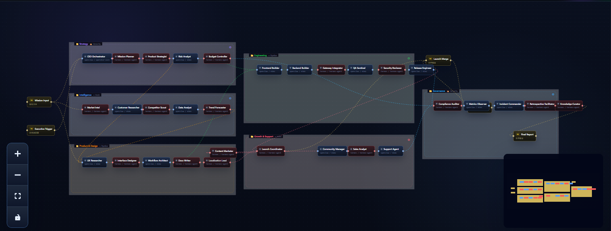
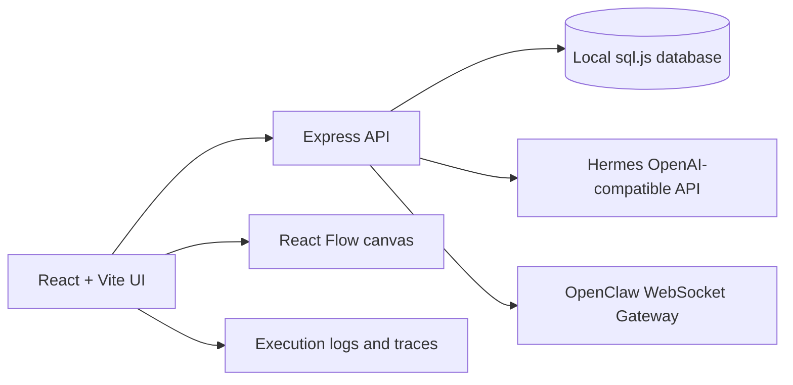

# Synapse Studio

[中文 README](README.zh-CN.md)

**A local-first canvas for orchestrating AI agents, control nodes, and execution traces.**


Synapse Studio turns local AI agents into a visual operating system. It is built for people who want to design, test, and observe multi-agent workflows without sending their private orchestration state to a hosted platform.



> The screenshot shows a showcase flow, **AI Company Operating System**, with 31 demo agents grouped by strategy, intelligence, product, engineering, growth, and governance. It is designed for visualization and does not require every demo node to connect to a real service.

## Why It Exists

Most agent tools hide coordination inside chat logs or server-side pipelines. Synapse Studio makes the coordination visible: you can place agents on a canvas, wire them together, inspect execution events, test gateway connectivity, and keep each agent's endpoint isolated.

## Highlights

- **Visual multi-agent canvas**: compose agent, input, trigger, and merge nodes with React Flow.
- **Local-first persistence**: flows, agents, and execution records are stored locally with `sql.js`.
- **Per-agent connection config**: Hermes and OpenClaw agents keep separate endpoints, models, and credentials.
- **Gateway testing**: test Hermes HTTP and OpenClaw WebSocket connections before running a flow.
- **Execution observability**: inspect errors, logs, traces, metrics, node outputs, and event timelines.
- **Bilingual interface**: switch Chinese and English directly from the sidebar.
- **GitHub-ready tooling**: ESLint, Prettier, TypeScript checks, Vitest, and GitHub Actions CI.

## Supported Gateways

| Gateway  | Protocol               | Typical URL             | Notes                                                     |
| -------- | ---------------------- | ----------------------- | --------------------------------------------------------- |
| Hermes   | OpenAI-compatible HTTP | `http://localhost:8642` | Uses `/health`, `/v1/models`, and `/v1/chat/completions`. |
| OpenClaw | WebSocket Gateway v3   | `ws://127.0.0.1:18789`  | Uses operator authentication and `chat.send`.             |

See [docs/agent-connections.md](docs/agent-connections.md) for field mapping, test commands, and troubleshooting.

## Quick Start

Requirements:

- Node.js 22 or newer
- npm
- Optional local Hermes/OpenClaw services

Windows:

```bash
npm ci
copy .env.example .env
npm run dev:all
```

macOS/Linux:

```bash
npm ci
cp .env.example .env
npm run dev:all
```

Open the app:

```text
Frontend: http://localhost:5173
Backend:  http://localhost:3000
```

Default local login:

```text
admin / admin
```

Change these credentials in your local `.env` before sharing a running instance.

## Configuration

The public template is `.env.example`:

```dotenv
PORT=3000
DEV_PORT=5173
AUTH_USERNAME=admin
AUTH_PASSWORD=admin
OPENCLAW_WS_URL=ws://localhost:18789
OPENCLAW_AUTH_TOKEN=
HERMES_API_URL=http://localhost:8642
HERMES_API_KEY=
```

Real tokens and API keys belong only in your local `.env` or local database. Do not commit:

- `OPENCLAW_AUTH_TOKEN`
- `HERMES_API_KEY`
- agent-specific tokens
- `data/` database files
- logs or local execution records

## Showcase Flow

This repository includes a safe demo flow at:

```text
docs/examples/mega-agent-company-flow.json
```

It contains no real endpoint, token, or API key. The flow is intended for screenshots, demos, and explaining what large-scale collaboration can look like on the canvas.

## Architecture



The frontend owns interaction, canvas editing, language switching, and execution views. The backend owns persistence, gateway health checks, flow execution, SSE events, and Hermes/OpenClaw protocol handling.

## Development

```bash
npm run dev          # frontend only
npm run dev:server   # backend only
npm run dev:all      # frontend and backend
npm run typecheck    # TypeScript check
npm run lint         # ESLint
npm run format       # Prettier write
npm run format:check # Prettier check
npm run test         # Vitest
npm run build        # production build
```

## Troubleshooting

### The browser says 127.0.0.1 refused the connection

Start both development servers:

```bash
npm run dev:all
```

### Hermes returns 502 or fetch failed

Check that Hermes is running:

```bash
curl http://localhost:8642/health
```

If your configured endpoint already ends with `/v1`, Synapse Studio will still build the chat completion URL correctly.

### OpenClaw handshake fails

Confirm:

- the WebSocket gateway is listening at the configured URL
- the token is current
- the selected session key exists
- the gateway supports protocol v3 operator mode

### Old errors still appear

Reload the page and run the flow again. New executions clear stale frontend debug state before starting.

## Roadmap

- Reusable workflow templates and import/export UI.
- Larger node library for routing, approval, scheduling, and memory.
- Stronger execution replay and diff views.
- Packaged local desktop distribution.
- More polished public demo flows.

## License

MIT. See [LICENSE](LICENSE).
