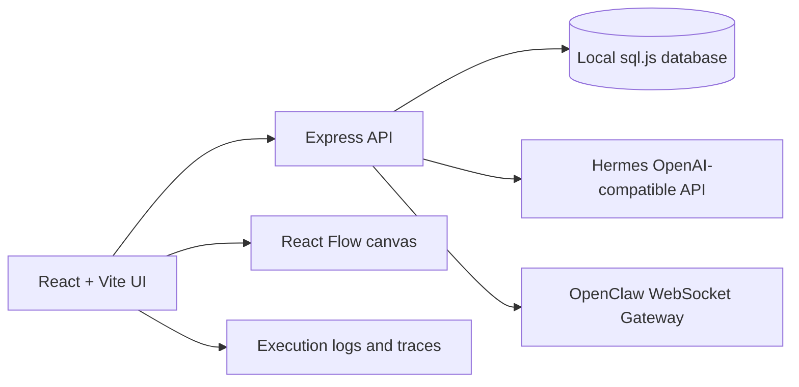

# Synapse Studio

[English README](README.md)

**一个本地优先的 AI 智能体编排工作台，用画布连接任务、智能体、控制节点和执行记录。**


Synapse Studio 可以把本地智能体连接成一个可视化操作系统。它适合用来设计、测试和观察多智能体工作流，同时把流程配置、执行记录和密钥留在本地。


> 上图是展示用流程 **AI Company Operating System**，包含 31 个演示智能体，按战略、情报、产品、工程、增长和治理分组。它用于展示画布能力，不要求每个演示节点都真实在线。

## 为什么做它

很多智能体工具把协作过程藏在聊天记录或后端流水线里。Synapse Studio 把协作过程放到画布上：你可以摆放智能体、连接节点、查看执行事件、测试网关连接，并让每个智能体使用自己的地址和凭据。

## 亮点

- **可视化多智能体画布**：基于 React Flow 组合智能体、输入、触发器和合并节点。
- **本地优先持久化**：流程、智能体配置和执行记录使用 `sql.js` 保存在本地。
- **按智能体单独配置连接**：Hermes 和 OpenClaw 智能体分别保存自己的地址、模型和凭据。
- **网关连接测试**：运行流程前可测试 Hermes HTTP 和 OpenClaw WebSocket 连接。
- **执行可观测性**：查看错误、日志、调用链、指标、节点输出和事件时间线。
- **中英文界面**：左侧栏可直接切换中文和英文。
- **GitHub 发布友好**：已配置 ESLint、Prettier、TypeScript 检查、Vitest 和 GitHub Actions CI。

## 支持的智能体网关

| 网关     | 协议                   | 常用地址                | 说明                                                   |
| -------- | ---------------------- | ----------------------- | ------------------------------------------------------ |
| Hermes   | OpenAI-compatible HTTP | `http://localhost:8642` | 使用 `/health`、`/v1/models` 和 `/v1/chat/completions` |
| OpenClaw | WebSocket Gateway v3   | `ws://127.0.0.1:18789`  | 使用 operator 认证和 `chat.send`                       |

字段映射、测试命令和排查方式见 [docs/agent-connections.md](docs/agent-connections.md)。

## 快速启动

环境要求：

- Node.js 22 或更新版本
- npm
- 可选：本地 Hermes/OpenClaw 服务

Windows:

```bash
npm ci
copy .env.example .env
npm run dev:all
```

macOS/Linux:

```bash
npm ci
cp .env.example .env
npm run dev:all
```

打开应用：

```text
前端: http://localhost:5173
后端: http://localhost:3000
```

默认本地登录：

```text
admin / admin
```

如果要把运行中的实例分享给别人，请先在本地 `.env` 中修改默认账号密码。

## 配置

公开配置模板是 `.env.example`：

```dotenv
PORT=3000
DEV_PORT=5173
AUTH_USERNAME=admin
AUTH_PASSWORD=admin
OPENCLAW_WS_URL=ws://localhost:18789
OPENCLAW_AUTH_TOKEN=
HERMES_API_URL=http://localhost:8642
HERMES_API_KEY=
```

真实 token 和 API key 只能放在本地 `.env` 或本地数据库里，不能提交：

- `OPENCLAW_AUTH_TOKEN`
- `HERMES_API_KEY`
- 智能体专属 token
- `data/` 数据库文件
- 日志或本地执行记录

## 展示流程

仓库包含一个安全的演示流程：

```text
docs/examples/mega-agent-company-flow.json
```

它不包含真实 endpoint、token 或 API key。这个流程适合截图、演示，以及说明大规模智能体协作在画布上可以是什么样子。

## 架构



前端负责交互、画布编辑、语言切换和执行记录展示；后端负责本地持久化、网关健康检查、流程执行、SSE 事件以及 Hermes/OpenClaw 协议适配。

## 开发命令

```bash
npm run dev          # 仅启动前端
npm run dev:server   # 仅启动后端
npm run dev:all      # 同时启动前端和后端
npm run typecheck    # TypeScript 检查
npm run lint         # ESLint
npm run format       # Prettier 写入格式化
npm run format:check # Prettier 格式检查
npm run test         # Vitest
npm run build        # 生产构建
```

## 常见问题

### 浏览器提示 127.0.0.1 拒绝连接

启动前后端开发服务：

```bash
npm run dev:all
```

### Hermes 返回 502 或 fetch failed

确认 Hermes 正在运行：

```bash
curl http://localhost:8642/health
```

如果配置的 endpoint 已经以 `/v1` 结尾，Synapse Studio 仍会正确拼接 chat completion 地址。

### OpenClaw 握手失败

确认：

- WebSocket 网关正在配置地址监听
- token 仍然有效
- 选中的 session key 存在
- 网关支持 v3 operator 协议

### 旧错误仍显示在调试面板

刷新页面后重新运行流程。新的执行开始前会清空前端旧调试状态。

## 路线图

- 可复用工作流模板和导入/导出 UI。
- 更丰富的节点库：路由、审批、调度、记忆等。
- 更强的执行回放和差异查看。
- 本地桌面打包发行。
- 更精致的公开演示流程。

## 许可证

MIT。见 [LICENSE](LICENSE)。
